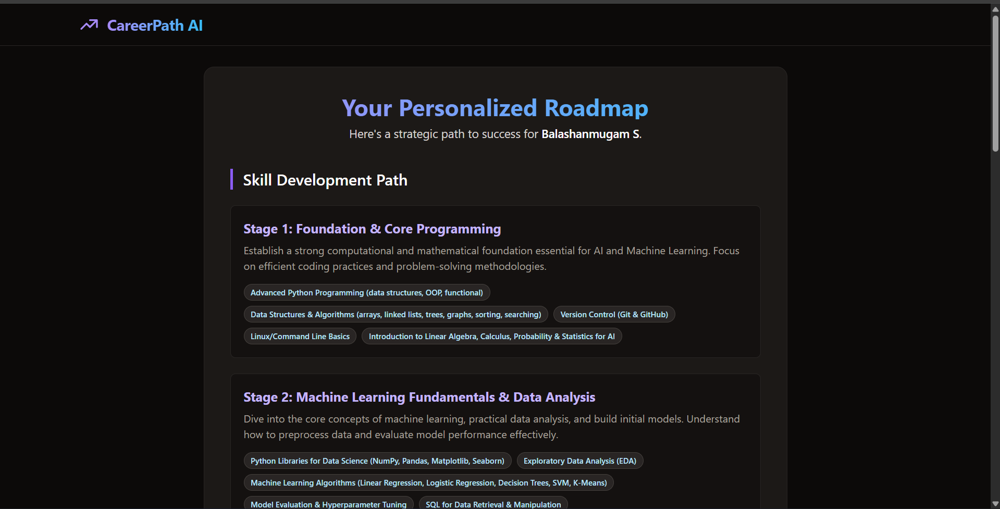

# 🎯 CareerPath AI — From Ambition to Action

> *Define your goal. Get a clear path. Start building your future.*

[](https://careerpath-ai-peach.vercel.app)
[](https://react.dev)
[](https://www.typescriptlang.org/)
[](https://github.com/Balashanmugam30/careerpath-ai)

**CareerPath AI** is an AI-powered career planning tool that converts unclear ambitions into structured, actionable learning roadmaps. Built for students and early professionals, it answers one critical question:

**“What should I learn next — and why?”**

---

## 🎥 Product Walkthrough

A short demonstration showing how CareerPath AI transforms a career goal into a practical learning roadmap.


---

## 🖥️ Interface Showcase

### 🚀 Where the Journey Begins
A focused entry point that captures intent and turns curiosity into direction.


### 🧠 Intelligence in Action
A dynamically generated roadmap that breaks complex roles into clear learning stages and milestones.



---

## 🧠 How It Works

CareerPath AI follows a streamlined decision-to-direction pipeline.

### Roadmap Generation Flow
1. User enters a target career role.
2. The system analyzes required skill domains.
3. AI structures a progressive learning path:
   - Foundations
   - Core Skills
   - Advanced Topics
   - Practical Projects
4. The roadmap is rendered instantly for the user.

---

## ⚡ Core Capabilities

- 🎯 Role-based career roadmaps  
- 🧠 Intelligent skill decomposition  
- ⚡ Instant roadmap generation  
- 🎨 Minimal, distraction-free UI  
- 🌐 Cloud-deployed and accessible anywhere  

---

## 🛠 Technology Stack

### Frontend
- React  
- TypeScript  
- Vite  
- Modern CSS  
- Vercel  

### AI Logic
- Prompt-driven roadmap generation  
- Frontend-rendered structured responses  

---

## 🚀 Live Application

🔗 https://careerpath-ai-peach.vercel.app/

---

## 🧪 Run Locally

```bash
git clone https://github.com/Balashanmugam30/careerpath-ai.git
cd careerpath-ai
npm install
npm run dev
````

Open in browser:

```
http://localhost:5173
```

---

## 📂 Project Structure

```
careerpath-ai/
├── assets/
│   ├── home.png
│   ├── roadmap.png
│   └── demo.gif
├── src/
│   ├── components/
│   ├── pages/
│   └── main.tsx
├── public/
├── package.json
├── vite.config.ts
└── README.md
```

---

## 👨‍💻 Author

**Balashanmugam S**

* GitHub: [https://github.com/Balashanmugam30](https://github.com/Balashanmugam30)
* LinkedIn: [https://www.linkedin.com/in/balashanmugams/](https://www.linkedin.com/in/balashanmugams/)
* Instagram: [https://www.instagram.com/balaxxh](https://www.instagram.com/balaxxh)

> *I build systems that replace uncertainty with clarity.*

```
```
